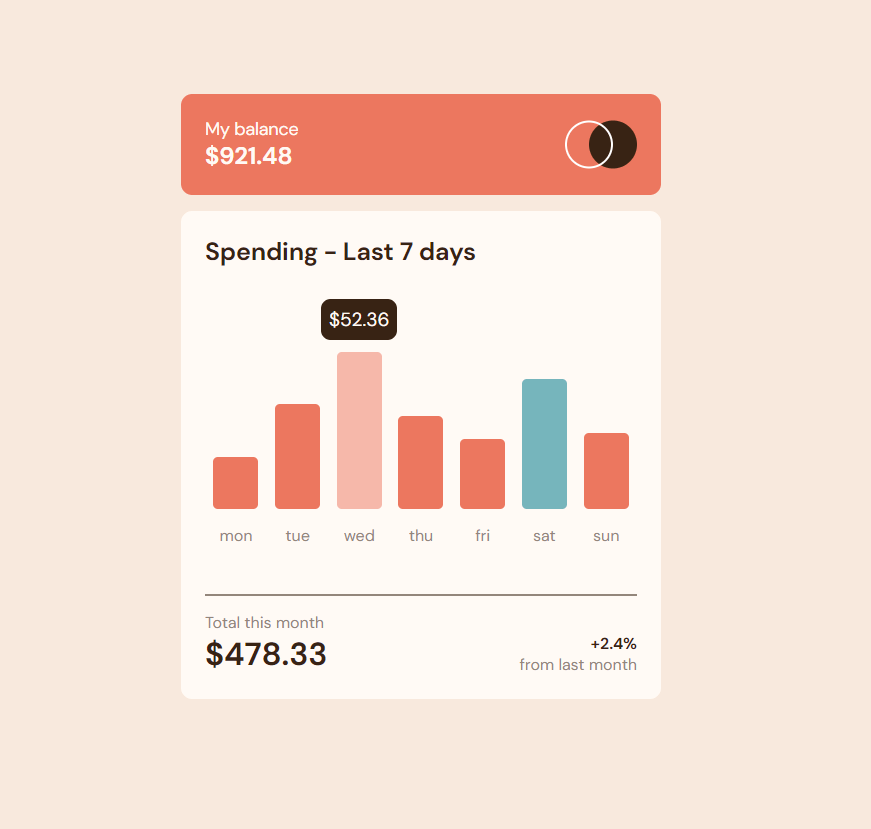

# Frontend Mentor - Expenses chart component solution

This is a solution to the [Expenses chart component challenge on Frontend Mentor](https://www.frontendmentor.io/challenges/expenses-chart-component-e7yJBUdjwt). Frontend Mentor challenges help you improve your coding skills by building realistic projects. 

## Table of contents

- [Frontend Mentor - Expenses chart component solution](#frontend-mentor---expenses-chart-component-solution)
  - [Table of contents](#table-of-contents)
  - [Overview](#overview)
    - [The challenge](#the-challenge)
    - [Screenshot](#screenshot)
    - [Links](#links)
  - [My process](#my-process)
    - [Built with](#built-with)
    - [What I learned](#what-i-learned)
  - [Author](#author)

## Overview

### The challenge

Users should be able to:

- View the bar chart and hover over the individual bars to see the correct amounts for each day
- See the current day’s bar highlighted in a different colour to the other bars
- View the optimal layout for the content depending on their device’s screen size
- See hover states for all interactive elements on the page

### Screenshot

Mobile


Desktop



### Links

- Solution URL: [GitHub](https://github.com/StalinAM/expenses-chart-component.git)
- Live Site URL: [StalinAM](https://stalinam.github.io/expenses-chart-component/)

## My process

### Built with

- Semantic HTML5 markup
- CSS custom properties
- Flexbox
- CSS Grid
- Mobile-first workflow

### What I learned

Code to make the price appear or disappear on mouse over

```js
    toogleHeight[i].addEventListener("mouseenter", () => {
        daysPrice[i].classList.remove('display')
    })

    toogleHeight[i].addEventListener("mouseleave", () => {
        daysPrice[i].classList.add('display')
    })
```

## Author

- GitHub - [StalinAM](https://github.com/StalinAM)
- Frontend Mentor - [@StalinAM](https://www.frontendmentor.io/profile/StalinAM)
